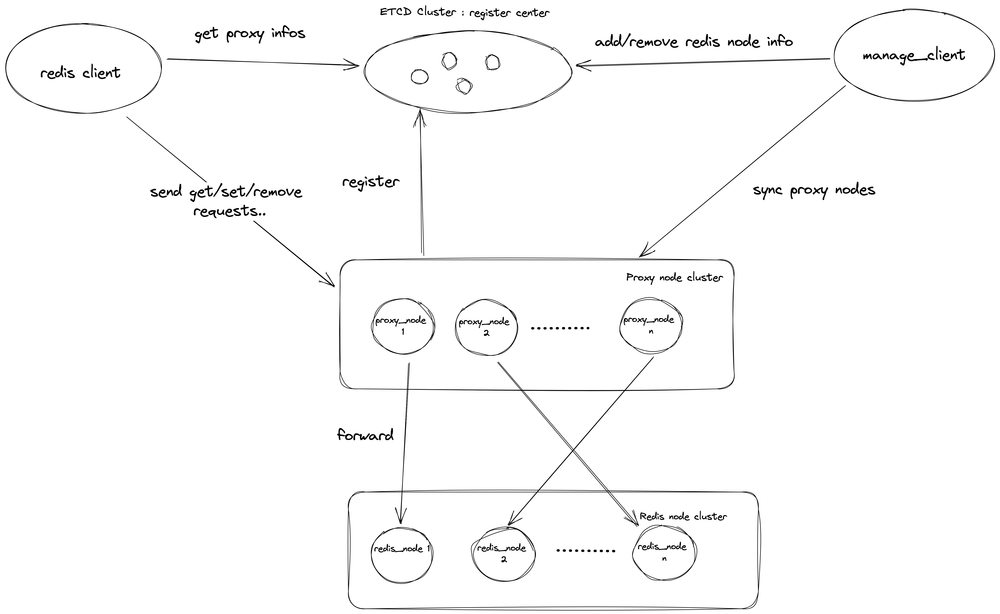

# 使用Rust实现Redis集群

## 集群架构



代理节点集群：用于转发redis客户端的请求到redis集群的节点。

manage_client：用于管理redis集群节点的注册和注销，以及把redis集群的信息同步给代理集群。

redis集群： 每个redis节点之间互相无感知，每个节点行为和单机redis时一致。

redis client： 向代理集群发送请求，与向单机redis节点发送请求的行一致。

## Example

### 环境：

Mac M1

### 启动步骤

1. 安装玩具etcd

```bash
homebrew install etcd
```

1. 启动玩具etcd，默认启动地址127.0.0.1:2380，正常打印日志代表成功启动。

```bash
>>> etcd
>>>
{"level":"info","ts":"2023-01-14T09:03:20.945+0800","caller":"api/capability.go:75","msg":"enabled capabilities for version","cluster-version":"3.5"}
{"level":"info","ts":"2023-01-14T09:03:20.945+0800","caller":"embed/etcd.go:584","msg":"serving peer traffic","address":"127.0.0.1:2380"}
{"level":"info","ts":"2023-01-14T09:03:20.945+0800","caller":"embed/etcd.go:275","msg":"now serving peer/client/metrics","local-member-id":"8e9e05c52164694d","initial-advertise-peer-urls":["http://localhost:2380"],"listen-peer-urls":["http://localhost:2380"],"advertise-client-urls":["http://localhost:2379"],"listen-client-urls":["http://localhost:2379"],"listen-metrics-urls":[]}
```

2. 编译redis-rs

```bash
# 需要安装protoc，用于编译grpc需要的protobuf文件
cargo build --release
```

3. 随便启动两个redis节点

```bash
# 启动第一个redis节点
# 1是redis节点id 0.0.0.0:8001是启动的地址
./target/release/redis_node 1 0.0.0.0:8001

# 启动一个新的命令行窗口，启动第二个redis节点
./target/release/redis_node 2 0.0.0.0:8002
```

4. 随便启动两个proxy节点

```bash
# 启动第一个proxy节点
# 1是代理节点id 0.0.0.0:7001是启动地址 http://localhost:2379是etcd集群地址
./target/release/proxy_node 1 0.0.0.0:7001 http://localhost:2379

# 启动一个新的命令行窗口，启动第二个proxy节点
./target/release/proxy_node 2 0.0.0.0:7002 http://localhost:2379
```

5. 使用manage_client来把两个redis节点注册到集群中

```bash
./target/release/manage-client http://localhost:2379 add 1 http://0.0.0.0:8001
./target/release/manage-client http://localhost:2379 add 2 http://0.0.0.0:8002
```

6. 使用redis_client测试set/get/remove等命令

```bash
#  http://localhost:2379是ectd地址

./target/release/redis_client http://localhost:2379 set key1 value1
2023-01-14T02:50:19.546Z INFO  [redis_client] Set key: "key1", value: "value1"

./target/release/redis_client http://localhost:2379 get key1
2023-01-14T02:50:40.077Z INFO  [redis_client] Get key: "key1", value: Some("value1")

./target/release/redis_client http://localhost:2379 delete key1 value1
2023-01-14T02:50:53.348Z INFO  [redis_client] Remove key: "key1"

./target/release/redis_client http://localhost:2379 get key1
2023-01-14T02:51:06.933Z INFO  [redis_client] Get key: "key1", value: None
```